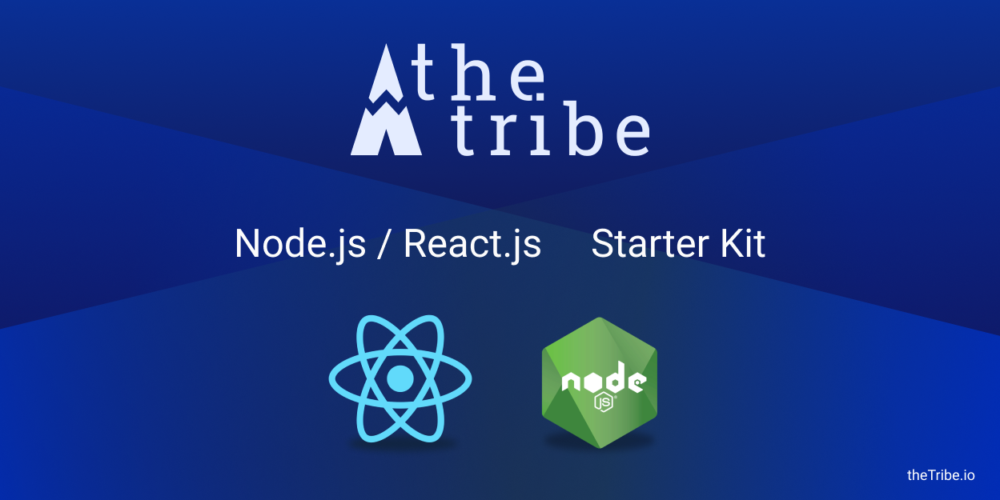

#### start the app

To run locally the project you should first install the dependencies

```bash
# for local environment
yarn install
yarn start

# for docker environment
docker-compose up -d
docker-compose stop app
docker-compose run --rm app yarn install
docker-compose run --rm app sequelize db:migrate
docker-compose start app
```

You may create a file `docker-compose.override.yml` at the root to override your configuration.
Most likely you might be interested in opening a port on the host, or use your yarn cache in docker containers.

```yaml
version: '2.0'
services:
  app:
    volumes:
      - ~/.cache/yarn:/home/app/.cache/yarn:rw
    ports:
      - 3000:3000
```


## Configure your user id

The containers are configured tu run with an user with ID 1000 to remove permissions problems, but if your user ID is
not 1000 you will need to configure the images to use your user ID.

You can get the your user ID by running `id -u`

If your user ID is not 1000 you will need to add the following config to your `docker-compose.override.yml`

```yaml
version: '2.0'
services:
  app:
    build:
      args:
        UID: YourUID
```

And then run `docker-compose build` to rebuild your containers.

### run the linter on your code

```bash
# run locally
yarn lint

# run in docker
docker-compose run --rm app lint
```

### build the app

```bash
# to build locally
yarn build

# to build a production image (docker)
docker build -f .production/Dockerfile -t [image:tag] .
```

### Run the production image locally

You might try to run the production image locally with `docker-compose`, to do so, simply create a new directory anywhere and use the following configuration.

```yaml
version: '2.0'
services:
    app:
        # use the right tag
        image: [image:tag]
        environment:
            DATABASE_HOST: postgres
            DATABASE_NAME: thetribe
            DATABASE_USER: thetribe
            DATABASE_PASSWORD: 424242
            # set the env as you need it
        depends_on:
            - postgres
        ports:
            - 3000:3000
    postgres:
        image: postgres:10.7
        environment:
            POSTGRES_USER: thetribe
            POSTGRES_PASSWORD: 424242
```

### Watch options

You may provide watch options for the compiler simply by writing a file named `watchOptions.config.js` at the root directory.

```js
module.exports = {
    // Watching may not work with NFS and machines in VirtualBox
    // Uncomment next line if it is your case (use true or interval in milliseconds)
    // poll: true,
    // Decrease CPU or memory usage in some file systems
    // ignored: /node_modules/,
};
```

### Global & module style sheets

You may import style sheets two ways in your app.
Firstly, if you important a style sheets from the directories `app/components` or `app/routes`,
your style will be imported as a module.
It means you have to import it and manipulate it that way ;

```js
// import it as a module
import style from './style.css';

// and use it that way
<div className={style.myDiv} />
```

However if you import a style sheet from elsewhere (node modules or another location in your sources),
it wil be imported as a global. It means you have to import it that way ;

```js
import './style.css';
```

You may either import CSS style sheets or SASS stylesheet (using the extension `.scss`).
